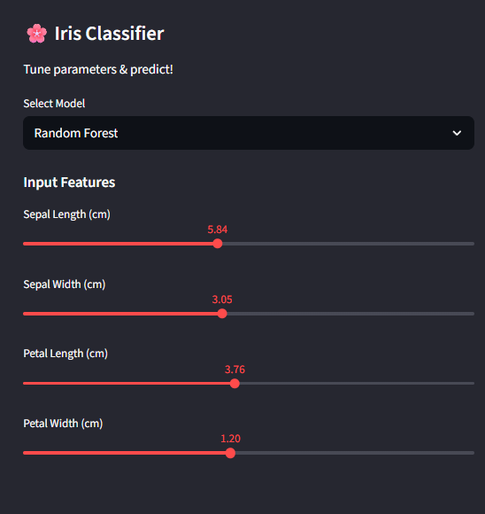
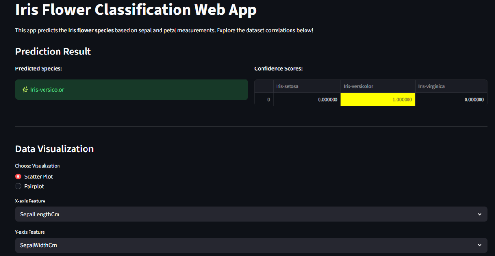
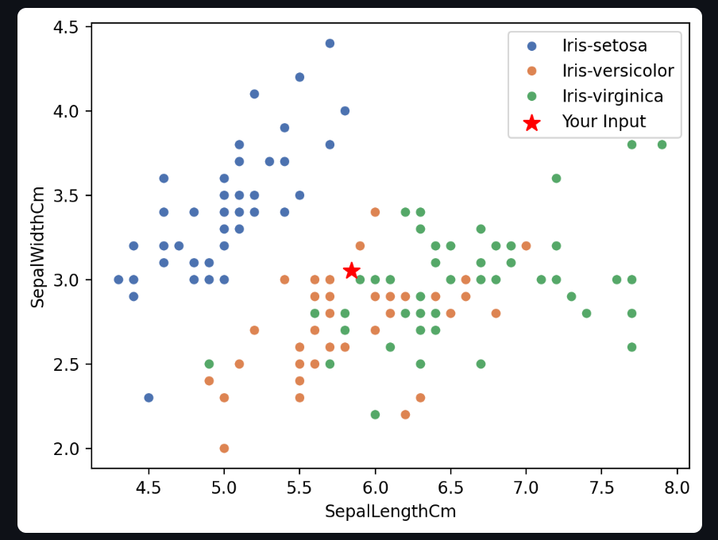

# 🌸 Iris Flower Classification Web App

A professional machine learning web application built with Streamlit to classify Iris flowers into three species: **Setosa**, **Versicolor**, and **Virginica**.

This project demonstrates an end-to-end ML pipeline:

- **Data**: Uses the classic [Iris dataset](https://archive.ics.uci.edu/ml/datasets/iris) (integrated via `Iris.csv` & `database.sqlite`).
- **Models**: Trains and compares 4 algorithms (Logistic Regression, KNN, Decision Tree, Random Forest).
- **App**: Interactive UI for real-time predictions and data visualization.

---

## 🚀 Features

- **Interactive Sidebar**: Adjust Sepal/Petal measurements using sliders.
- **Model Selection**: Switch between Random Forest, Logistic Regression, KNN, and Decision Trees.
- **Real-time Prediction**: Instant classification with confidence probability scores.
- **Visualizations**: Dynamic scatter plots and pairplots to explore feature relationships.
- **Custom Dataset**: Seamlessly integrated with local dataset files.

## � Screenshots

|        Sidebar Controls        |          Prediction Result           |
| :----------------------------: | :----------------------------------: |
|  |  |

### Interactive Visualizations



## 🔗 Live Demo

Check out the live application here: [**Live Cloud App**](https://iris-species-detection-htfimwuuv2ccqhaehfggfw.streamlit.app/) 

## �🛠️ Installation

1. **Clone the repository**:

   ```bash
   git clone https://github.com/yourusername/Iris-Flower-Classification.git
   cd Iris-Flower-Classification
   ```

2. **Install dependencies**:

   ```bash
   pip install -r requirements.txt
   ```

3. **Train Models** (Optional - pre-trained models included):

   ```bash
   python train_model.py
   ```

4. **Run the App**:
   ```bash
   streamlit run app.py
   ```

## 📂 Project Structure

```
.
├── app.py                  # Main Streamlit application
├── train_model.py          # Script to train and save models
├── create_submission.py    # Script to generate Kaggle submission
├── requirements.txt        # Python dependencies
├── models/                 # Directory containing trained .pkl models
├── Iris.csv                # Dataset file
├── database.sqlite         # SQLite version of the dataset
└── README.md               # Project documentation
```

## 📊 Models Used

- **Random Forest Classifier** (Default/Recommended)
- Logistic Regression
- K-Nearest Neighbors (KNN)
- Decision Tree Classifier

## 🤝 Contribution

Feel free to fork this repository and submit pull requests. For major changes, please open an issue first to discuss what you would like to change.

---

_Built with ❤️ using [Streamlit](https://streamlit.io/)_
